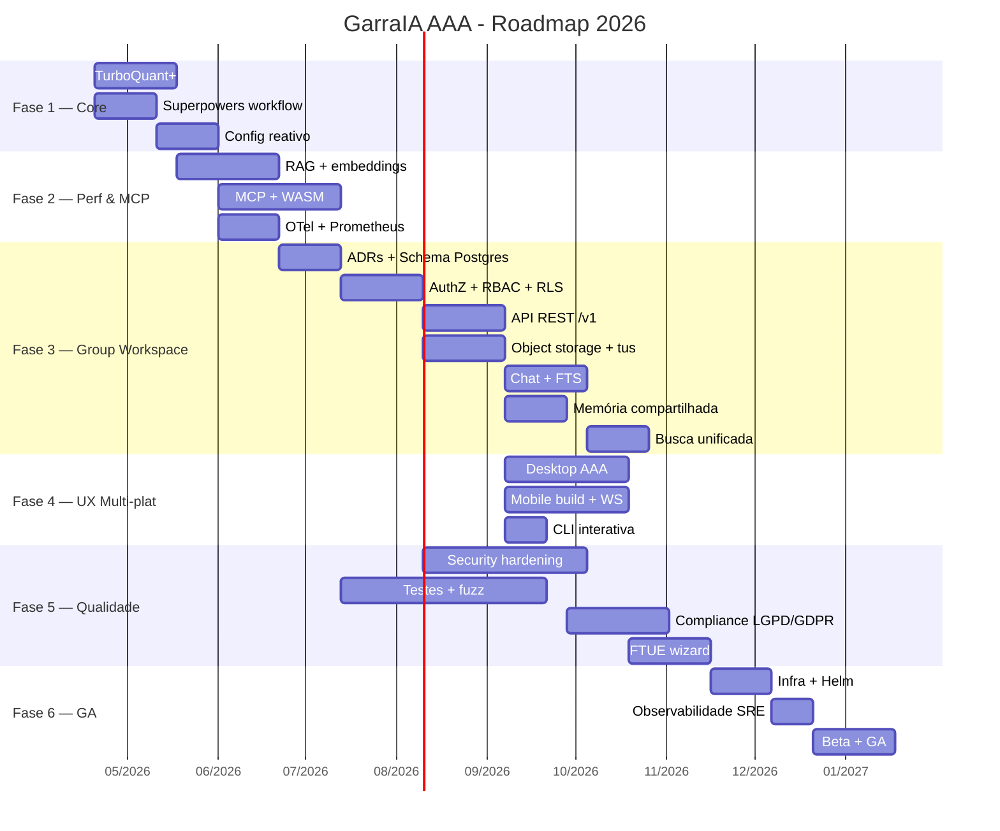

# GarraIA — ROADMAP AAA

> Roadmap unificado do ecossistema GarraIA (CLI, Gateway, Desktop, Mobile, Agents, Channels, Voice) rumo ao padrão **AAA**. Funde o plano de inferência local + workflows agenticos com a nova direção de produto **Group Workspace** (família/equipe multi-tenant) derivada de `deep-research-report.md`.
>
> **Última atualização:** 2026-05-01 (local America/New_York)
> **Owner:** @michelbr84
> **Equipe Linear:** GAR
> **Branch base:** `main`

---

## 0. North Star

> **"Garra é o sistema nervoso de IA da sua família, do seu estúdio e da sua empresa — local-first, privado por padrão, multi-canal, e com agentes que colaboram entre si."**

### Pilares

1. **Local-first & Privado por padrão** — inferência, memória e arquivos rodam na máquina do usuário, sincronização opcional.
2. **Multi-tenant real** — separação rígida entre memória pessoal, de grupo e de chat (novo Group Workspace).
3. **Multi-canal unificado** — Telegram, Discord, Slack, WhatsApp, iMessage, Mobile, Desktop, CLI, Web, todos compartilhando o mesmo runtime de agentes.
4. **Agentico por dentro** — sub-agentes com TDD, worktrees e orquestração mestre-escravo via Superpowers.
5. **Compliance first** — LGPD (art. 46-49) e GDPR (art. 25, 32, 33) tratados como requisito funcional, não afterthought.
6. **Observável e tunável** — OpenTelemetry + Prometheus + traces por request desde o dia 1 das fases novas.

### Critérios globais de "AAA-ready"

- `cargo check --workspace` e `cargo clippy --workspace -- -D warnings` **verdes**.
- Cobertura de testes ≥ 70% em crates de domínio (`garraia-agents`, `garraia-db`, `garraia-security`, `garraia-workspace`).
- Zero `unwrap()` fora de testes; zero SQL por concatenação; zero secrets em logs.
- Changelog por release, migrations forward-only, feature flags por tenant/grupo.
- Runbooks de incidente + backup/restore testados trimestralmente.

---

## 1. Baseline honesto (onde estamos em 2026-04-13)

**O que já existe e compila:**

- Workspace Cargo com 16 crates, Axum 0.8, Tauri v2 scaffold, Flutter mobile scaffold.
- `garraia-gateway`: HTTP + WS, admin API, MCP registry, bootstrap de canais/providers/tools.
- `garraia-agents`: providers OpenAI, OpenRouter, Anthropic, Ollama, `AgentRuntime` com tools.
- `garraia-db`: SQLite via rusqlite (sessions, messages, memory, chat_sync, mobile_users).
- `garraia-security`: `CredentialVault` AES-256-GCM + PBKDF2 (parcial).
- `garraia-channels`: adapters Telegram/Discord/Slack/WhatsApp/iMessage.
- `garraia-voice`: STT Whisper (dual endpoint) + TTS (Chatterbox/ElevenLabs/Kokoro stubs).
- Mobile (Flutter): auth JWT + chat + mascote — roda no emulator Android.
- Desktop (Tauri v2): scaffold + sidecar Windows MSI.

**O que ainda é stub, frágil ou ausente:**

- Sem Postgres (toda persistência é SQLite single-file — bloqueia multi-tenant real).
- Sem object storage (arquivos grandes, anexos, versionamento).
- Sem modelo de grupo/membros/RBAC — hoje é mono-usuário por instalação.
- Sem embeddings locais nem busca vetorial.
- Sem OpenTelemetry, sem métricas estruturadas.
- CredentialVault ainda não é **fonte única** de secrets do gateway (parcialmente wired).
- Mobile build Android com gradle/SDK desatualizados em alguns caminhos.
- Desktop UI sem micro-interações; apenas WebView básico.
- MCP servers não rodam em sandbox WASM.
- Sem wizard de onboarding; `.env.example` ainda é o caminho oficial.
- Cobertura de testes: baixa nos crates de domínio; quase zero em integração.

Esse baseline define o que as fases seguintes precisam mover.

---

## 1.5. Atualização 2026-05-01 — Green Security Baseline e progresso Q6

> Esta seção é um snapshot incremental sobre o §1 acima: NÃO substitui o
> baseline original, apenas reporta o que mudou desde 2026-04-13. Próxima
> revisão estrutural do §1 fica para depois de GAR-491/GAR-490 mergearem.

### Sprint **Green Security Baseline 2026-04-30** (umbrella [GAR-486](https://linear.app/chatgpt25/issue/GAR-486))

Sub-issues 1-3 ✅ done implicitamente em `main@7fc838b`. Sub-issues 4-5 em andamento.

| PR | Commit | Conteúdo |
|----|--------|----------|
| [#104](https://github.com/michelbr84/GarraRUST/pull/104) (A) | `eccfb85` | Secret cleanup + `.gitleaksignore` + pre-commit gitleaks hook + runbook |
| [#105](https://github.com/michelbr84/GarraRUST/pull/105) (B) | `e35ecd7` | `jsonwebtoken 9 → 10` com backend `rust_crypto` + `getrandom::fill` direto (substituiu/fechou Dependabot PR #103) |
| [#106](https://github.com/michelbr84/GarraRUST/pull/106) (C) | `895b6ee` | CodeQL **advanced setup** (`.github/workflows/codeql.yml` + `.github/codeql-config.yml`) excluindo `garraia-desktop` (Tauri) |
| [#107](https://github.com/michelbr84/GarraRUST/pull/107) (D) | `09d805c` | `docs/security/dependabot-status.md` — alert-to-rationale index com Linear ownership map |
| [#108](https://github.com/michelbr84/GarraRUST/pull/108) (E) | `7fc838b` | `wasmtime 44.0.0 → 44.0.1` lockfile-only fix-forward (fecha [GHSA-p8xm-42r7-89xg](https://github.com/advisories/GHSA-p8xm-42r7-89xg)) |

**Métricas do sprint** (verificadas empiricamente em 2026-05-01 via
`gh api`):

- Secret-scanning alerts: 1 → **0** (alert #1 resolved/revoked 2026-04-30T15:55:45Z)
- Dependabot alerts: **20 → 7** — todos os 7 residuais com Linear ownership em [`docs/security/dependabot-status.md`](docs/security/dependabot-status.md)
- CodeQL total open: **90** (medição da Phase 0 desta sessão, advanced setup já em main) → **84** após os 6 dismissals do GAR-491. O description original do GAR-486 mencionava "~90 → 71" como projeção do efeito do `paths-ignore`, mas a medição direta via `gh api ... code-scanning/alerts | length` retornou 90 alertas open antes de qualquer triagem ativa nesta sessão. Triagem ativa só começou via GAR-491 (Wave 2) e levou o total para 84. GAR-490 (Wave 1) ataca os 16 path-injection + 8 sql-injection restantes na sessão futura.
- GitHub-native CodeQL default setup: `configured` → `not-configured` (advanced setup é canonical)
- `continue-on-error: true` em workflows: 4 removidos no Lote 2 (PR #64, GAR-438) + 1 no Lote 4 (PR sobre Playwright `data-testid`); restante intencional (1 RUSTSEC residual)

### CodeQL triage **ainda em aberto** (esta sessão)

Sub-issues 4 e 5 de GAR-486 estão em execução agora:

- **[GAR-491](https://linear.app/chatgpt25/issue/GAR-491) — CodeQL Wave 2 (fixtures + suppression convention)** — sub-issue 5/5, **In Progress** desde 2026-05-01, PR [#109](https://github.com/michelbr84/GarraRUST/pull/109) draft. Estabelece a convenção de suppression para Rust CodeQL via REST API dismissal + ledger versionado em [`docs/security/codeql-suppressions.md`](docs/security/codeql-suppressions.md) + [`docs/security/codeql-suppressions.json`](docs/security/codeql-suppressions.json) + script [`scripts/security/codeql-reapply-dismissals.sh`](scripts/security/codeql-reapply-dismissals.sh) com fail-closed validation (rule_id/path/line). 6 alertas em escopo, 21 deferidos para `GAR-491.1`.
- **[GAR-490](https://linear.app/chatgpt25/issue/GAR-490) — CodeQL Wave 1 (production paths)** — sub-issue 4/5, **Backlog**, bloqueada por GAR-491. 16 path-injection (`skills_handler.rs`, `skins_handler.rs`) + 8 sql-injection (`rest_v1/groups.rs`, `rest_v1/invites.rs`). Plano de ataque: helper `validate_skill_name` em handlers + integração de `garraia_storage::sanitise_key` em `skins_handler.rs` (single-segment) + experimento `SELECT set_config('app.current_user_id', $1, true)` substituindo `SET LOCAL ... format!()` antes de qualquer dismissal.

**Decisão central documentada**: Rust CodeQL ainda **não suporta** comentários inline `// codeql[rule]: ...` em 2026 ([github/codeql#21638](https://github.com/github/codeql/issues/21637) aberto). `paths-ignore` global não serve porque os testes do GarraRUST são INLINE (`#[cfg(test)] mod tests {}`) dentro de produção. Mecanismo escolhido: ledger versionado + REST dismissal por alerta + script fail-closed. **Sem fallback global**: se a empirical proof falhar, abort + nova decisão (sem `query-filters: exclude` por rule-id). Ver [`docs/security/codeql-suppressions.md`](docs/security/codeql-suppressions.md) §3-§6.

### Quality gates Q6 — status atual

- **GAR-436 (mutation testing baseline)** ✅ — `cargo-mutants` pilot em `garraia-auth`. Run inicial 85% killed (19 missed). PR [#94](https://github.com/michelbr84/GarraRUST/pull/94) appended run `25116031135`: **85.04% → 90.78% killed (+5.74 p.p.)**.
- **GAR-463 Q6.1** ✅ — kill 5 critical mutation bypasses em `garraia-auth/src/hashing.rs` + `lib.rs` (PR #92).
- **GAR-468 Q6.6** ✅ — kill 3 Debug-redaction mutation bypasses em `garraia-auth` (PR [#96](https://github.com/michelbr84/GarraRUST/pull/96)). **Memória local**: rodar Q6 sub-issues 6.1-6.7 ainda pendentes (`project_next_session_q6_queue`).
- **GAR-469 Q6.7** ✅ — `mutants.yml` timeout bumped 90 → 150 min (PR #93).
- **GAR-481 Q6.8** ✅ — workflows migrated to **Node 24** (`actions/{checkout,setup-node,upload-artifact,download-artifact,cache}` v4 → latest, deprecation pre-announce 2026-Q3) (PR [#95](https://github.com/michelbr84/GarraRUST/pull/95)).

### CI infrastructure

- **GAR-438 (Lote 2)** ✅ (PR [#64](https://github.com/michelbr84/GarraRUST/pull/64), `1828625`) — fix `e2e` + `playwright` jobs que tentavam executar `./target/release/garraia-gateway` (binário inexistente — `garraia-gateway` é biblioteca). Substituído por `cargo build --bin garraia --release` + `services: postgres:16.8-alpine` + envs de auth via `::add-mask::`. 4 de 7 `continue-on-error: true` removidos.
- **GAR-443 (Lote 4)** ✅ — Playwright admin specs migrados para `getByTestId(...)` ancorados em `data-testid` estáveis (`admin.html`). Convenção: especificações Playwright do admin DEVEM preferir `data-testid` em vez de `placeholder*=` ou `getByRole(button,{name})`.
- **GitHub Actions annotations follow-up (2026-05-03)** — CI voltou a ficar verde após PR [#113](https://github.com/michelbr84/GarraRUST/pull/113), mas os jobs `Analyze (javascript-typescript)` e `Analyze (rust)` ainda emitem 2 annotations não-bloqueantes: (a) `github/codeql-action/init@v3` + `analyze@v3` rodam em Node.js 20 (forced switch 2026-06-02, removido em 2026-09-16) — escopo expandido em [GAR-482](https://linear.app/chatgpt25/issue/GAR-482) (Q6.9 third-party Node 24 readiness); (b) CodeQL Action v3 será deprecated em dezembro de 2026 — rastreado em [GAR-502](https://linear.app/chatgpt25/issue/GAR-502) (chore migrate v3 → v4). Manutenção preventiva de CI/runtime, **não** alerta CodeQL real (esses ficam em [GAR-490](https://linear.app/chatgpt25/issue/GAR-490) / [GAR-491](https://linear.app/chatgpt25/issue/GAR-491)) e **não** bloqueia o merge verde atual.
- **CARGO_BIN_EXE_garraia removal** ([GAR-503](https://linear.app/chatgpt25/issue/GAR-503)) — fallback dead-code em `crates/garraia-cli/tests/migrate_workspace_integration.rs:34-42` para remover.
- **Benchmark evidence run** ([GAR-504](https://linear.app/chatgpt25/issue/GAR-504)) — primeira execução real de `benches/agent-framework-comparison/run.sh --all` em droplet DigitalOcean 1 vCPU / 1 GB para repor a tabela do `README.md` (PR [#117](https://github.com/michelbr84/GarraRUST/pull/117) §"Open follow-ups").
- **Mutation Testing 2026-05-04 missed mutants** ([GAR-505](https://linear.app/chatgpt25/issue/GAR-505)) — sub-issue de [GAR-436](https://linear.app/chatgpt25/issue/GAR-436) cobrindo 6 NEW missed mutants em `jwt.rs` / `storage_redacted.rs` / `app_pool.rs` + 3 timeouts (run [25307117776](https://github.com/michelbr84/GarraRUST/actions/runs/25307117776)).
- **AI Quality Ratchet PR-1** (epic novo, plan [`0064`](plans/0064-quality-ratchet-pr1.md), 2026-05-05) — scaffold do sistema de catraca de qualidade. PR-1 entrega `.quality/{baseline,README,thresholds}`, `scripts/quality/{collect-metrics.sh, compare.py, freeze-baseline.py, parse-{llvm-cov,cargo-audit,clippy}.py + tests/}`, `.github/workflows/quality-ratchet.yml` em modo report-only via flag `compare.py --mode report-only` (zero `continue-on-error`), `.claude/commands/quality-babysit.md` em modo manual-only, e `CODEOWNERS` como camada inicial de visibilidade. **Out of scope deste PR**: duplicação (PR-3), promoção a bloqueante (PR-4 com aprovação explícita), branch protection (sempre com aprovação explícita). Plan-mãe com filosofia + 5 ajustes do owner: `~/.claude/plans/voc-est-no-projeto-buzzing-volcano.md` (não versionado). Linear issue TBD após merge.

### Status do umbrella [GAR-486](https://linear.app/chatgpt25/issue/GAR-486)

✅ **Done** (2026-05-04). Fechado após [GAR-490](https://linear.app/chatgpt25/issue/GAR-490) (PR [#112](https://github.com/michelbr84/GarraRUST/pull/112), 2026-05-04) e [GAR-491](https://linear.app/chatgpt25/issue/GAR-491) (PR [#109](https://github.com/michelbr84/GarraRUST/pull/109), 2026-05-01) mergearem.

---

## 2. Estrutura do roadmap

O roadmap está dividido em **7 fases + trilhas contínuas**. Cada fase tem:

- **Objetivo** (uma frase)
- **Entregáveis** (checklist executável)
- **Critérios de aceite** (verificáveis)
- **Dependências** (fases/entregáveis prévios)
- **Estimativa** (semanas: baixa / provável / alta)
- **Épicos Linear (GAR)** quando aplicável

Fases 1-2 são **fundação técnica**. Fase 3 é o **salto de produto** (Group Workspace). Fase 4 é **experiência**. Fase 5 é **qualidade/compliance**. Fase 6 é **lançamento**. Fase 7 é **pós-GA**. Trilhas contínuas cortam todas as fases.

---

## Fase 1 — Fundações de Core & Inferência (6-9 semanas)

**Objetivo:** fechar as lacunas do motor local e do runtime para que as fases 2-3 possam construir em terreno firme.

### 1.1 TurboQuant+ — Inferência local otimizada

- [ ] Benchmark dos providers locais atuais (Ollama, llama.cpp) em latência/tokens-por-segundo em `benches/inference.rs` (Criterion).
- [ ] **KV Cache compression** para sessões longas: investigar integração com `llama.cpp` flags `--cache-type-k q8_0 --cache-type-v q8_0`; expor via `garraia-agents` como opção `kv_quant` no provider config.
- [ ] **PagedAttention / Continuous Batching**: avaliar `candle` vs `mistral.rs` como backend alternativo em Rust nativo; decisão registrada em ADR `docs/adr/0001-local-inference-backend.md`.
- [ ] **Backends paralelos**: detectar CUDA/MPS/Vulkan em runtime e passar flags apropriadas.
- [ ] **Quantização**: suporte a modelos Q4_K_M, Q5_K_M, Q8_0 com auto-seleção por VRAM disponível.

**Critério de aceite:**

- Latência p95 ≤ 80% da baseline em sessões ≥ 32k tokens.
- `garraia-cli bench` roda comparação local vs cloud e emite relatório em markdown.

### 1.2 Superpowers Workflow & Auto-Dev

- [ ] `.claude/superpowers-config.md` expandido com perfis de projeto (backend-rust, mobile-flutter, docs-only).
- [ ] **TDD com sub-agentes**: skill `/tdd-loop` chama `@code-reviewer` para validar cada ciclo Red-Green-Refactor.
- [ ] **Git worktrees automatizados**: script `scripts/worktree-experiment.sh` cria branch + worktree + ambiente isolado; integração com Superpowers já existente.
- [ ] **Orquestrador mestre-escravo**: `team-coordinator` pode delegar tarefas para `garraia-agents` localmente (dogfooding) — útil para CI.

**Critério de aceite:**

- Um bug real do backlog é corrigido end-to-end via `/fix-issue` sem intervenção manual além de approve/merge.

#### 1.2.1 GarraMaxPower — modo agente avançado nativo do Garra

> Adaptação **nativa** das ideias de ClaudeMaxPower/Superpowers para o runtime do Garra. **Não é** copiar `.claude/` literalmente nem rodar `scripts/setup.sh` do ClaudeMaxPower — é trazer as primitivas (capability prompt, workflow brainstorm→spec→plan→execute→review→finish, skills, agent team, safety gates, handoff/Auto Dream, validações locais) para dentro do binário `garra` e dos crates do workspace, com superfície pequena, versionada e executável.

**Objetivo:**

Dar ao Garra um modo agente avançado de primeira-classe acionável por `garra max-power` (ou equivalente) que orquestra brainstorm → spec → plan → execute → review → finish usando os providers/canais/tools que o gateway já expõe, com safety gates contra comandos destrutivos e memória persistente entre sessões.

**Escopo do MVP:**

- Comando `garra max-power` (no `garraia-cli`) que ativa o modo, imprime banner e roteia para a próxima ação certa.
- **Capability prompt** nativo (não importado do `.claude/`) montado em runtime a partir do que o `AgentRuntime` realmente expõe (providers, tools, canais, MCP servers ativos).
- Workflow `brainstorm → spec → plan → execute → review → finish` como máquina de estados explícita em `garraia-agents` (ou novo crate `garraia-maxpower`), com gate obrigatório no `spec` antes de qualquer escrita de código.
- **Repo workflow seguro** para GitHub: clonar/branch/PR via `gh`/`git` com checagens de "branch atual não é `main`" e "tree limpo antes de force operations".
- **Safety gates de bash** centralizados (uma única função que valida antes de spawnar): bloqueia `rm -rf /`, `rm -rf ~`, fork bombs, `git push --force` em `main`, escrita em `.env`/credenciais.
- 3-5 **skills MVP** nativas (não markdown solto): `brainstorm`, `write-spec`, `write-plan`, `pre-commit`, `verify` — registradas no `garraia-skills` registry.
- **Agent team MVP**: orquestrador + 2 sub-agentes (revisor + executor) usando `AgentRuntime` real, sem depender do plugin Superpowers do Claude Code.
- **Handoff / Auto Dream**: arquivo `.garra-estado.md` versionado com último spec, último plan, último review, próxima ação — lido no início da próxima sessão.
- `garra verify` — validação local idempotente: `cargo fmt --check`, `cargo clippy --workspace -- -D warnings`, `cargo test --workspace`, `flutter analyze` (se presente), `gitleaks` (se presente). Sai com exit code estilo `sysexits` (0/2/65).

**Fora de escopo (explícito):**

- Não copiar/sincronizar `.claude/`, `cmp-skills/`, `superpowers-bridge.md` ou qualquer arquivo do harness do Claude Code para dentro do runtime do Garra.
- Não rodar `scripts/setup.sh` do ClaudeMaxPower como parte do bootstrap do Garra.
- Não escrever tokens/credenciais em config local — qualquer secret continua via `CredentialVault` ou env, conforme regra absoluta §6 do `CLAUDE.md`.
- Não reescrever `garraia-agents` para isso. GarraMaxPower **consome** o runtime existente; não substitui.
- Não criar dependência hard de Claude Code, Anthropic SDK ou qualquer provider específico — o capability prompt é provider-agnóstico.
- Não tentar reproduzir 100% das skills do plugin Superpowers em uma única tacada. MVP = 3-5 skills.

**Entregáveis:**

1. ADR `docs/adr/0009-garra-max-power.md` — decisão arquitetural, escopo, alternativas avaliadas.
2. Subseção §1.2.1 deste ROADMAP (este documento).
3. Subcomando `garra max-power` no `garraia-cli` (esqueleto + roteamento, sem implementação dos passos pesados).
4. Crate ou módulo `garraia-maxpower` (ou seção em `garraia-skills`) com a máquina de estados do workflow.
5. Função `safety_gate(cmd: &str) -> Result<()>` em `garraia-tools` ou `garraia-common`, com testes unitários cobrindo a denylist mínima.
6. Skills MVP em `garraia-skills` (registry-driven, não arquivos markdown soltos).
7. `garra verify` em `garraia-cli` com pipeline Rust+Flutter+gitleaks.
8. `.garra-estado.md` schema documentado + leitor/escritor.
9. Issues Linear filhas (épico GarraMaxPower abaixo) referenciadas neste documento.

**Critérios de aceite:**

- `garra max-power --help` imprime o pipeline e os entry points alternativos sem panic.
- `garra max-power --goal "fix bug X"` roteia para `systematic-debugging` com rationale visível.
- Tentativa de executar `rm -rf /` ou `git push --force origin main` via tool/agent é bloqueada pela safety gate com erro determinístico (testado).
- `garra verify` em `main` limpo retorna exit 0 e relatório markdown; em árvore com clippy warning retorna exit ≠ 0.
- Workflow brainstorm→spec→plan→execute em um bug real do backlog termina com PR aberto + review pelo agent team, sem intervenção manual além de approve.
- `cargo check --workspace` e `cargo clippy --workspace -- -D warnings` permanecem verdes.
- ADR 0009 está em `Accepted` antes do merge da última issue filha.

**Riscos:**

- **Escopo creep:** virar uma reescrita do `garraia-agents`. Mitigação: fora-de-escopo explícito acima; cada issue filha é pequena e fecha sozinha.
- **Acoplamento ao Claude Code:** capability prompt acabar dependente de campos específicos do Anthropic SDK. Mitigação: prompt provider-agnóstico, testado contra OpenAI + OpenRouter + Ollama mínimo.
- **Safety gate falso-negativo:** denylist incompleta deixa passar comando destrutivo. Mitigação: testes unitários table-driven + revisão por `@security-auditor` antes de merge.
- **Drift com ClaudeMaxPower upstream:** as ideias evoluem fora do nosso repo. Mitigação: ADR registra qual *snapshot* das ideias foi adaptado; updates futuros viram issues separadas.
- **Memória/Auto Dream PII-leak:** `.garra-estado.md` versionado com prompt do usuário pode vazar dados. Mitigação: schema com allow-list de campos; nada de message bodies por padrão.
- **CI overhead:** `garra verify` em CI pode ficar lento. Mitigação: passos paralelos + cache; budget documentado por etapa.

**Issues Linear filhas do épico [GAR-492](https://linear.app/chatgpt25/issue/GAR-492):**

- `GarraMaxPower roadmap + ADR` ([GAR-493](https://linear.app/chatgpt25/issue/GAR-493)) — esta seção + ADR 0009 (umbrella já registra; issue filha amarra commits).
- `/max-power MVP` ([GAR-494](https://linear.app/chatgpt25/issue/GAR-494)) — subcomando `garra max-power` esqueleto + roteamento + banner.
- `Capability prompt nativo` ([GAR-495](https://linear.app/chatgpt25/issue/GAR-495)) — gerador provider-agnóstico em runtime, testado contra ≥ 3 providers.
- `Repo workflow seguro` ([GAR-496](https://linear.app/chatgpt25/issue/GAR-496)) — wrappers `gh`/`git` com pré-checagens; cobertura de "main protegida" e "tree limpo".
- `Safety gates para bash` ([GAR-497](https://linear.app/chatgpt25/issue/GAR-497)) — `safety_gate(cmd)` + denylist + testes + integração com tools.
- `Skills MVP` ([GAR-498](https://linear.app/chatgpt25/issue/GAR-498)) — 3-5 skills nativas via registry `garraia-skills`.
- `Agent team MVP` ([GAR-499](https://linear.app/chatgpt25/issue/GAR-499)) — orquestrador + 2 sub-agentes, dogfooded em um bug real.
- `Auto Dream / handoff` ([GAR-500](https://linear.app/chatgpt25/issue/GAR-500)) — schema `.garra-estado.md` + reader/writer + redaction.
- `garra verify` ([GAR-501](https://linear.app/chatgpt25/issue/GAR-501)) — pipeline local idempotente, exit-codes sysexits, relatório markdown.

**Estimativa:** 3 / 5 / 8 semanas, em paralelo a 1.2 e 1.3.

### 1.3 Config & Runtime Wiring unificado

- [ ] **Schema único** de config em `garraia-config` (novo crate) com `serde` + `validator`; fontes: `.garraia/config.toml` > `mcp.json` > env > CLI flags.
- [ ] **Reactive config**: endpoint SSE `GET /v1/admin/config/stream` emite eventos ao alterar config via Web UI/CLI; `AppState` reage sem restart.
- [ ] **Provider hot-reload**: alterar API keys ou endpoints propaga para `AgentRuntime` em < 500ms.
- [ ] **Dry-run validation**: `garraia-cli config check` valida config sem iniciar o servidor.

**Critério de aceite:**

- Teste de integração altera `models.default` via PATCH admin e verifica que a próxima chamada de chat usa o novo modelo sem reiniciar processo.

**Estimativa fase 1:** 6 / 8 / 12 semanas.
**Épicos Linear sugeridos:** `GAR-TURBO-1`, `GAR-SUPERPOWERS-1`, `GAR-CONFIG-1`.

---

## Fase 2 — Performance, Memória de Longo Prazo & MCP Ecosystem (8-12 semanas)

**Objetivo:** dar a Garra memória vetorial local veloz, plugins sandboxed e telemetria zero-latency.

### 2.1 Memória de longo prazo & RAG local

- [ ] **Embeddings locais**: integrar `mxbai-embed-large-v1` via `ort` (onnxruntime) em novo crate `garraia-embeddings`. Fallback para `fastembed-rs`.
- [ ] **Vector store**: escolha documentada em ADR `docs/adr/0002-vector-store.md` entre `lancedb` (embutido, colunar) e `qdrant` (embutido ou sidecar). Recomendação inicial: **lancedb** pela simplicidade de deploy.
- [ ] **Schema**: tabelas `memory_embeddings(memory_item_id, vector, model, created_at)` e índice HNSW.
- [ ] **RAG pipeline**: `garraia-agents` ganha `RetrievalTool` que faz ANN search + re-rank por BM25 (via `tantivy`) + injeção em prompt.
- [ ] **Governance**: TTL, sensitivity level (`public|group|private`), auditoria de acesso.

**Critério de aceite:**

- Chat consulta "o que eu disse sobre X semana passada?" e recupera top-5 memórias do próprio usuário em < 200ms p95.

### 2.2 MCP + Plugins WASM

- [ ] **MCP servers expandidos**: registro dinâmico via admin API; health-check periódico.
- [ ] **WASM sandbox**: integrar `wasmtime` em novo crate `garraia-plugins`; plugins expõem interface WIT (`wit-bindgen`).
- [ ] **Capabilities-based**: cada plugin declara permissões (`net`, `fs:/allowed/path`, `llm:call`) — nenhum por padrão.
- [ ] **Self-authoring tools**: sub-agentes podem gerar plugins WASM via template e testá-los no sandbox antes de registrar.
- [ ] **Plugin registry local**: `~/.garraia/plugins/` com manifesto assinado (ed25519).

**Critério de aceite:**

- Um plugin de exemplo (`fetch-rss`) é gerado por sub-agente, compilado para WASM, assinado, carregado e executado sem escapar do sandbox (teste com `proptest`).

### 2.3 Zero-latency streaming & Telemetria

**Status:** ✅ baseline entregue em 2026-04-13 via [GAR-384](https://linear.app/chatgpt25/issue/GAR-384) (commit `84c4753`). Crate `garraia-telemetry` em produção atrás de feature flag `telemetry` (default on). Follow-ups: [GAR-411](https://linear.app/chatgpt25/issue/GAR-411) (TLS docs, cardinality, idempotência) e [GAR-412](https://linear.app/chatgpt25/issue/GAR-412) (/metrics auth não-loopback).

- [ ] **Tokio tuning**: buffers enxutos em WebSocket handlers; `tokio-tungstenite` com `flush_interval` configurável.
- [x] **OpenTelemetry**: crate `garraia-telemetry` com `tracing-opentelemetry` 0.27 + `opentelemetry-otlp` 0.26 (gRPC), fail-soft init, sampler `TraceIdRatioBased`, guard RAII com shutdown em Drop. ✅
- [x] **Prometheus**: `/metrics` baseline com 4 métricas (`requests_total`, `http_latency_seconds`, `errors_total`, `active_sessions`) via `metrics-exporter-prometheus 0.15`, bind default `127.0.0.1:9464`. ✅ (métricas adicionais por subsistema ficam como issue futuro)
- [x] **Trace correlation**: `request_id` via `tower-http::SetRequestIdLayer` + propagate layer; `#[tracing::instrument]` em `AgentRuntime::process_message*` (skip_all, has_user_id boolean para LGPD) e `SessionStore::append_message*`/`load_recent_messages`. ✅
- [x] **PII safety**: `http_trace_layer()` exclui headers dos spans por default; `redact.rs` com header allowlist; `redaction_smoke.rs` como regression guard. ✅
- [x] **Infra local**: `ops/compose.otel.yml` (Jaeger 1.60 + Prometheus v2.54 + Grafana 11.2) com provisioning de datasources. ✅
- [ ] **Dashboards**: templates Grafana em `ops/grafana/dashboards/` para latência, errors, inference p95, fila de jobs. (folder stub existe, dashboards como issue futuro)

**Critério de aceite:**

- [x] Uma requisição de chat gera trace com spans `http.request` → `agent.run` (process_message_impl) → `db.persist` (append_message) — todos correlacionados via `x-request-id`. ✅

**Estimativa fase 2:** 8 / 10 / 14 semanas.
**Épicos Linear sugeridos:** `GAR-RAG-1`, `GAR-WASM-1`, `GAR-OTEL-1`.

---

## Fase 3 — Group Workspace (família/equipe multi-tenant) — **NOVO** (12-20 semanas)

**Objetivo:** transformar Garra de mono-usuário em **workspace compartilhado** com arquivos, chats e memória IA escopados por grupo, conforme `deep-research-report.md`.

**Status (2026-04-15):** 🟢 **Epic GAR-391 FECHADO — Fase 3.3 completa.** Plan 0014 (GAR-391d, app-layer cross-group authz matrix via HTTP) entregue em `a688497` / PR #17: 15-case table-driven matrix sobre `GET /v1/me`, `POST /v1/groups`, `GET /v1/groups/{id}` × {alice, bob, eve} com fixture `seed_user_without_group`. Revisões `security-auditor` + `code-reviewer` APPROVE. Rule 10 do `CLAUDE.md` satisfeita para os 3 endpoints tenant-scoped existentes. Histórico da Fase 3.3: ADR 0003 + ADR 0005 (com Amendment 2026-04-13) accepted; `garraia-workspace` com **10 migrations**; `garraia-auth` com `Principal` extractor (Axum) + `RequirePermission` struct method + `Role`/`Action` enums tipados + `fn can()` central (110-case test) + `SignupPool` newtype + `signup_user` free function + `RedactedStorageError` wrapper + `AuthConfig` em `garraia-config` + 4 endpoints `/v1/auth/{login,refresh,logout,signup}` wired no `AppState` real + métricas Prometheus baseline + **migration 010** fechando os 3 structural gaps (Gap A `GRANT SELECT ON sessions`, Gap B `garraia_signup NOLOGIN BYPASSRLS`, Gap C `GRANT SELECT ON group_members`) + **GAR-392 RLS matrix** (plan 0013, 81 cenários). ADRs 0004 (storage), 0006 (search) e 0008 (docs collab) ainda pendentes.

> Esta é a fase de maior valor de produto e a de maior risco de segurança. Tudo aqui nasce com "privacidade por padrão" e testes de autorização.

### 3.1 Decisões arquiteturais (ADRs obrigatórios antes de codar)

- [x] [`docs/adr/0003-database-for-workspace.md`](docs/adr/0003-database-for-workspace.md) — **Postgres 16 + pgvector + pg_trgm** escolhido com benchmark empírico em [`benches/database-poc/`](benches/database-poc/). SQLite mantido para dev/CLI single-user. Entregue em 2026-04-13 via [GAR-373](https://linear.app/chatgpt25/issue/GAR-373). ✅
- [ ] `docs/adr/0004-object-storage.md` — S3 compatível (MinIO default self-host; suporte R2/S3/GCS/Azure). Versionamento obrigatório. ([GAR-374](https://linear.app/chatgpt25/issue/GAR-374))
- [x] [`docs/adr/0005-identity-provider.md`](docs/adr/0005-identity-provider.md) — **`garraia_login` BYPASSRLS dedicated role + Argon2id RFC 9106 + HS256 JWT v1 + lazy upgrade dual-verify PBKDF2→Argon2id** escolhidos. Resolve o hard blocker do login flow sob RLS documentado em GAR-408. Trait `IdentityProvider` shape congelada para futuros adapters OIDC. Entregue em 2026-04-13 via [GAR-375](https://linear.app/chatgpt25/issue/GAR-375). ✅
- [ ] `docs/adr/0006-search-strategy.md` — Postgres FTS (tsvector) como start, Tantivy como evolução, Meilisearch como opção externa. ([GAR-376](https://linear.app/chatgpt25/issue/GAR-376))

### 3.2 Domínio & Schema

Crate `garraia-workspace` ✅ **schema completo da Fase 3** entregue em 2026-04-13/14 via 8 migrations sequenciais: 001 (GAR-407, users/groups/sessions/api_keys), 002 (GAR-386, RBAC + audit_events + single-owner index), 004 (GAR-388, chats + messages com `tsvector` GIN + compound FK), 005 (GAR-389, memory_items + memory_embeddings com pgvector HNSW cosine), 006 (GAR-390, tasks Tier 1 Notion-like com RLS embedded), 007 (GAR-408, FORCE RLS em 10 tabelas com NULLIF fail-closed + prova empírica via ownership transfer panic-safe), 008 (GAR-391a, `garraia_login NOLOGIN BYPASSRLS` dedicated role + 4 GRANTs exatos do ADR 0005) e 009 (GAR-391b prereq, `user_identities.hash_upgraded_at`). Smoke test testcontainers `pgvector/pgvector:pg16` cobre todas as migrations em ~10-13s wall. PII-safe `Workspace` handle via `#[instrument(skip(config))]` + custom `Debug` redacting `database_url`. Slot 003 reservado para GAR-387 (files, bloqueado por ADR 0004). Plans: [`plans/0003`](plans/0003-gar-407-workspace-schema-bootstrap.md) → [`plans/0010`](plans/0010-gar-391a-garraia-auth-crate-skeleton.md) → [`plans/0011.5`](plans/0011.5-gar-391b-migration-009-hash-upgraded-at.md).

**Tabelas (Postgres + SQLx migrations):**

- [x] `users` (`id`, `email citext`, `display_name`, `status`, `legacy_sqlite_id`, `created_at`, `updated_at`) — migration 001 ✅
- [x] `user_identities` (`id`, `user_id`, `provider`, `provider_sub`, `password_hash`, `created_at`) — OIDC-ready, migration 001 ✅
- [x] `sessions` (`id`, `user_id`, `refresh_token_hash UNIQUE`, `device_id`, `expires_at`, `revoked_at`, `created_at`) — migration 001 ✅
- [x] `api_keys` (`id`, `user_id`, `label`, `key_hash UNIQUE`, `scopes jsonb`, `created_at`, `revoked_at`, `last_used_at`) — Argon2id pinned, migration 001 ✅
- [x] `groups` (`id`, `name`, `type`, `created_by`, `settings jsonb`, `created_at`, `updated_at`) — migration 001 ✅
- [x] `group_members` (`group_id`, `user_id`, `role`, `status`, `joined_at`, `invited_by`) — migration 001 ✅
- [x] `group_invites` (`id`, `group_id`, `invited_email citext`, `proposed_role`, `token_hash UNIQUE`, `expires_at`, `created_by`, `created_at`, `accepted_at`, `accepted_by`) — migration 001 ✅
- [x] `roles`, `permissions`, `role_permissions` — migration 002 ✅ (5 roles + 22 permissions + 63 role_permissions, seed estático)
- [x] `audit_events` (`id`, `group_id`, `actor_user_id`, `actor_label`, `action`, `resource_type`, `resource_id`, `ip`, `user_agent`, `metadata`, `created_at`) — NO FK intencional, sobrevive CASCADE para LGPD art. 8 §5 / GDPR art. 17(1), migration 002 ✅
- [x] `group_members_single_owner_idx` — partial unique index `WHERE role = 'owner'` (fecha GAR-414 M1), migration 002 ✅
- [x] `chats` (`id`, `group_id`, `type` — channel/dm/thread, `name`, `topic`, `created_by`, `settings jsonb`, `archived_at`, `UNIQUE (id, group_id)`) — migration 004 ✅
- [x] `chat_members` (composite PK `(chat_id, user_id)`, `role` chat-local, `last_read_at`, `muted`) — migration 004 ✅
- [x] `messages` (`id`, `chat_id`, **`group_id` denormalizado**, `sender_user_id`, `sender_label`, `body` CHECK len 1..100k, **`body_tsv tsvector GENERATED STORED + GIN`**, `reply_to_id ON DELETE SET NULL`, `thread_id` plain uuid, `deleted_at` soft-delete, **compound FK `(chat_id, group_id) → chats(id, group_id)`**) — migration 004 ✅
- [x] `message_threads` (`id`, `chat_id`, `root_message_id UNIQUE`, `title`, `resolved_at`) — migration 004 ✅
- [ ] `message_attachments` — deferido até GAR-387 (files) materializar
- [ ] `folders` (`id`, `group_id`, `parent_id`, `name`)
- [ ] `files`, `file_versions`, `file_shares`
- [x] `memory_items` (`id`, `scope_type` CHECK user/group/chat, `scope_id` sem FK, **`group_id` NULL-able** para user-scope, `created_by ON DELETE SET NULL` + `created_by_label` cache, `kind` CHECK 6 valores, `content` CHECK 10k, `sensitivity` CHECK 4 níveis + partial index em secret, `source_chat_id/source_message_id ON DELETE SET NULL`, `ttl_expires_at` CHECK future) — migration 005 ✅
- [x] `memory_embeddings` (`memory_item_id` FK CASCADE, `model` CHECK 256, `embedding vector(768)`, PK `(memory_item_id, model)`, **HNSW `vector_cosine_ops`** index) — migration 005 ✅
- [x] **Row-Level Security (FORCE) em 10 tabelas tenant-scoped** (`messages`, `chats`, `chat_members`, `message_threads`, `memory_items`, `memory_embeddings`, `audit_events`, `sessions`, `api_keys`, `user_identities`) com 3 classes de policies (direct / JOIN / dual) + `NULLIF(current_setting(...), '')::uuid` fail-closed + role `garraia_app` NOLOGIN + `ALTER DEFAULT PRIVILEGES` forward-compat + 8 cenários de smoke test incluindo **prova empírica de FORCE** via ownership transfer para role não-superuser (com `scopeguard::defer!` panic-safe) — migration 007 ✅. **Impacto em GAR-391:** login flow precisa de role BYPASSRLS ou SECURITY DEFINER para ler `user_identities.password_hash` (hard blocker documentado no README).

**Critério de aceite do schema:**

- Migrations forward-only aplicam do zero em < 30s.
- `EXPLAIN ANALYZE` nas queries críticas (list messages, list files, memory ANN) < 50ms p95 com 1M de linhas.

### 3.3 Runtime Scopes & RBAC

Novo crate: `garraia-auth` (separado de `garraia-security`).

**Status (2026-04-13):** 🟢 **Skeleton entregue** via GAR-391a — crate `garraia-auth` existe com `IdentityProvider` trait + `InternalProvider` stub + `LoginPool` newtype validado por `current_user` + migration `008_login_role.sql` criando `garraia_login NOLOGIN BYPASSRLS` com 4 GRANTs exatos do ADR 0005. Próximas fatias: **391b** (`verify_credential` real + dual-verify + JWT), **391c** (extractor Axum + `RequirePermission` + wiring), **391d**/GAR-392 (suite cross-group authz). [ADR 0005](docs/adr/0005-identity-provider.md) accepted; trait shape congelada.

- [x] **Skeleton (GAR-391a):** crate `garraia-auth` + `IdentityProvider` trait + `InternalProvider` stub + `LoginPool` newtype com `static_assertions::assert_not_impl_all!(LoginPool: Clone)` + migration 008 + smoke tests (3 unit + 3 integration). ✅
- [x] `struct Principal { user_id, group_id, role: Option<Role> }` — typed `Role` enum shipped in 391c; `Principal` implements `FromRequestParts` with JWT verify + optional group membership lookup. ✅
- [x] **`verify_credential` real (GAR-391b):** Argon2id (RFC 9106 first recommendation `m=64MiB, t=3, p=4`) + PBKDF2 dual-verify + lazy upgrade transacional + `SELECT ... FOR NO KEY UPDATE OF ui` + constant-time anti-enumeration via `DUMMY_HASH` gerado em build.rs + `audit_events` em todos os terminais + JWT HS256 access token (15min, algorithm-confusion guards) + endpoint `POST /v1/auth/login` sob feature `auth-v1` retornando 401 byte-identical em todos os modos de falha. 32 testes verdes (16 unit + 13 integration garraia-auth + 3 endpoint integration garraia-gateway). ✅
- [x] **Refresh tokens + `SessionStore::issue` no endpoint (GAR-391c):** migration 010 adiciona `GRANT SELECT ON sessions TO garraia_login` (Gap A); `POST /v1/auth/refresh` (rotação default ON) + `POST /v1/auth/logout` (idempotente, 204 sempre) shipped default-on. ✅
- [x] **`create_identity` real + signup endpoint (GAR-391c):** `garraia_signup NOLOGIN BYPASSRLS` role + `SignupPool` newtype análogo ao `LoginPool` + `signup_user` free function + `POST /v1/auth/signup` endpoint (201 + tokens em sucesso, 409 em duplicate email). Gap B fechado. ✅
- [x] **`Principal` extractor + `RequirePermission` (GAR-391c):** `Principal` implementa `FromRequestParts` (Bearer JWT verify + optional `X-Group-Id` membership lookup via Gap C `GRANT SELECT ON group_members`); `RequirePermission` é struct method `check()` + free function `require_permission()` (NOT `FromRequestParts` por const-generic limitation do Axum). ✅
- [x] `fn can(principal: &Principal, action: Action) -> bool` central — 22-action enum, 5-role enum, 110-case table-driven test (`can_matrix_matches_seed`) cobrindo as 63 rows seedadas em migration 002. ✅
- [x] Papéis: `Owner`, `Admin`, `Member`, `Guest`, `Child` — `Role` enum tipado com tier numérico (100/80/50/20/10) batendo com `roles` seed. ✅
- [x] **Capabilities (22 variants):** `files.*`, `chats.*`, `memory.*`, `tasks.*`, `docs.*`, `members.manage`, `group.{settings,delete}`, `export.{self,group}` — `Action` enum mapeado via `fn can()`. ✅
- [ ] `enum Scope { User(Uuid), Group(Uuid), Chat(Uuid) }` com regra de resolução `Chat > Group > User`.
- [x] **Defense-in-depth**: Postgres RLS (`CREATE POLICY`) em `messages`, `chats`, `chat_members`, `message_threads`, `memory_items`, `memory_embeddings`, `audit_events`, `sessions`, `api_keys`, `user_identities`, `task_lists`, `tasks`, `task_assignees`, `task_labels`, `task_label_assignments`, `task_comments`, `task_subscriptions`, `task_activity` — 18 tabelas com FORCE RLS + NULLIF fail-closed. Migrations 006 e 007. ✅
- [x] **Identity provider decision:** [ADR 0005](docs/adr/0005-identity-provider.md) — BYPASSRLS dedicated role (`garraia_login` NOLOGIN BYPASSRLS) + Argon2id (m=64MiB, t=3, p=4) + HS256 JWT + PBKDF2→Argon2id lazy upgrade dual-verify + `IdentityProvider` trait shape congelada. ✅
- [ ] **Guardrails Child/Dependent**: sem export, sem share externo, content filter aplicado pré-LLM.

**Critério de aceite:**

- Suite de testes `tests/authz/` com > 100 cenários (cross-group leak attempts, role escalation, token replay) — 100% verde.
- Teste específico: usuário do grupo A **não** consegue listar, ler, buscar, nem aparecer em auditoria do grupo B mesmo tentando IDs diretos.

### 3.4 API REST `/v1` (OpenAPI documented)

Contrato versionado. Usar `utoipa` para gerar OpenAPI + Swagger UI em `/docs`.

**Grupos**

- [x] `GET /v1/groups` — plan 0105 / [GAR-580](https://linear.app/chatgpt25/issue/GAR-580), implementado 2026-05-12 (Florida)
- [x] `POST /v1/groups` — plan 0016 M4, entregue 2026-04-14
- [x] `GET /v1/groups/{group_id}` — plan 0016 M4, entregue 2026-04-14
- [x] `PATCH /v1/groups/{group_id}` — plan 0017, entregue 2026-04-16
- [x] `POST /v1/groups/{group_id}/invites` — plan 0018, entregue 2026-04-16
- [x] `POST /v1/groups/{group_id}/members/{user_id}:setRole` — plan 0020, entregue 2026-04-20
- [x] `DELETE /v1/groups/{group_id}/members/{user_id}` — plan 0020, entregue 2026-04-20
- [x] `GET /v1/groups/{group_id}/members` — plan 0097 / [GAR-574](https://linear.app/chatgpt25/issue/GAR-574), implementado 2026-05-11 (Florida)
- [x] `GET /v1/groups/{group_id}/invites` — plan 0097 / [GAR-574](https://linear.app/chatgpt25/issue/GAR-574), implementado 2026-05-11 (Florida)
- [x] `GET /v1/me` — plan 0015 (skeleton Fase 3.4), entregue 2026-04-14

**Chats**

- [x] `POST /v1/groups/{group_id}/chats` — plan 0054 / [GAR-506](https://linear.app/chatgpt25/issue/GAR-506), implementado 2026-05-04 (Florida)
- [x] `GET /v1/groups/{group_id}/chats` — plan 0054 / [GAR-506](https://linear.app/chatgpt25/issue/GAR-506), implementado 2026-05-04 (Florida)
- [x] `POST /v1/chats/{chat_id}/messages` — plan 0055 / [GAR-507](https://linear.app/chatgpt25/issue/GAR-507), implementado 2026-05-05 (Florida)
- [x] `GET /v1/chats/{chat_id}/messages?cursor=...` — plan 0055 / [GAR-507](https://linear.app/chatgpt25/issue/GAR-507), implementado 2026-05-05 (Florida)
- [x] `POST /v1/messages/{message_id}/threads` — plan 0058 / [GAR-509](https://linear.app/chatgpt25/issue/GAR-509), implementado 2026-05-05 (Florida)
- [ ] WebSocket `/v1/chats/{chat_id}/stream` com backpressure

**Arquivos**

- [x] `POST /v1/groups/{group_id}/files` (direct upload, v1 created atomically) — plan 0099 / [GAR-577](https://linear.app/chatgpt25/issue/GAR-577), implementado 2026-05-11 (Florida)
- [ ] `POST /v1/groups/{group_id}/files:initUpload` (presigned URL + multipart)
- [ ] `POST /v1/groups/{group_id}/files:completeUpload`
- [x] `GET /v1/groups/{group_id}/files?folder_id=...` + `GET /v1/groups/{group_id}/folders` ✅ PR #235 GAR-555
- [x] `GET /v1/groups/{group_id}/files/{file_id}` + `GET /v1/groups/{group_id}/folders/{folder_id}` (single resource read) — plan 0090 / [GAR-559](https://linear.app/chatgpt25/issue/GAR-559), implementado 2026-05-09 (Florida) ✅ PR #242 (`4adcb02`)
- [x] `PATCH /v1/groups/{group_id}/files/{file_id}` (rename) — plan 0089 / [GAR-557](https://linear.app/chatgpt25/issue/GAR-557), implementado 2026-05-09 (Florida) ✅ PR #238 (`9255515`)
- [x] `GET /v1/files/{file_id}/download` (streaming bytes via ObjectStore) — plan 0093 / [GAR-564](https://linear.app/chatgpt25/issue/GAR-564), implementado 2026-05-10 (Florida) ✅ PR #250 (`b2de161`)
- [x] `POST /v1/groups/{group_id}/files/{file_id}/versions` (new content version, direct upload) — plan 0094 / [GAR-567](https://linear.app/chatgpt25/issue/GAR-567), implementado 2026-05-10 (Florida)
- [x] `GET /v1/groups/{group_id}/files/{file_id}/versions` (list content versions, cursor-paginated) — plan 0095 / [GAR-569](https://linear.app/chatgpt25/issue/GAR-569), implementado 2026-05-10 (Florida) ✅ PR #253 (`0cc9a85`)
- [x] `DELETE /v1/files/{file_id}` (soft delete + lixeira) ✅ PR #235 GAR-555
- [ ] Suporte a **tus** (resumable upload) como alternativa

**Memória**

- [x] `GET /v1/memory?scope_type=group&scope_id=...` — plan 0062 / [GAR-514](https://linear.app/chatgpt25/issue/GAR-514), implementado 2026-05-05 (Florida)
- [x] `POST /v1/memory` — plan 0062 / [GAR-514](https://linear.app/chatgpt25/issue/GAR-514), implementado 2026-05-05 (Florida)
- [x] `DELETE /v1/memory/{id}` — plan 0062 / [GAR-514](https://linear.app/chatgpt25/issue/GAR-514), implementado 2026-05-05 (Florida)
- [x] `POST /v1/memory/{id}/pin` — plan 0072 / [GAR-526](https://linear.app/chatgpt25/issue/GAR-526), implementado 2026-05-06 (Florida)
- [x] `POST /v1/memory/{id}/unpin` — plan 0072 / [GAR-526](https://linear.app/chatgpt25/issue/GAR-526), implementado 2026-05-06 (Florida)
- [x] `GET /v1/memory/{id}` — plan 0074 / [GAR-528](https://linear.app/chatgpt25/issue/GAR-528), implementado 2026-05-06 (Florida)
- [x] `PATCH /v1/memory/{id}` — plan 0074 / [GAR-528](https://linear.app/chatgpt25/issue/GAR-528), implementado 2026-05-06 (Florida)

**Busca unificada**

- [x] `GET /v1/search?q=...&scope_type=group&scope_id=<uuid>&types=messages,memory` — plan 0084 / [GAR-549](https://linear.app/chatgpt25/issue/GAR-549), implementado 2026-05-08 (Florida). Slice 1: messages (body_tsv GIN) + memory_items (runtime tsvector). Files deferred.
- [x] `GET /v1/search?...&scope_type=chat&scope_id=<chat_uuid>` + `scope_type=user&scope_id=<user_uuid>` — plan 0085 / [GAR-551](https://linear.app/chatgpt25/issue/GAR-551), implementado 2026-05-08 (Florida). Slice 2 lifts the slice-1 group-only restriction; user-scope rejects `types=messages` (no user-scoped messages exist).
- [x] `GET /v1/search?...&from_date=<iso8601>&to_date=<iso8601>&author_id=<uuid>` — plan 0086 / [GAR-552](https://linear.app/chatgpt25/issue/GAR-552), implementado 2026-05-09 (Florida). Slice 3: date-range filters on `created_at` (messages + memory); `author_id` filters `messages.sender_user_id` (rejected for user scope). `has_attachment` deferred (requires schema change).

**Auditoria**

- [x] `GET /v1/groups/{group_id}/audit?cursor=...` — plan 0070 / [GAR-522](https://linear.app/chatgpt25/issue/GAR-522), implementado 2026-05-05 (Florida)

**Erros:** todos os erros seguem **RFC 9457 Problem Details**.

**Critério de aceite:**

- Spec OpenAPI 3.1 gerada e servida em `/docs`.
- Contract tests via `schemathesis` ou `dredd` rodam em CI.

### 3.5 Object storage & uploads

Novo crate: `garraia-storage`.

- [ ] Abstração `trait ObjectStore` com impls: `LocalFs`, `S3Compatible` (via `aws-sdk-s3`), `Minio`.
- [ ] **Presigned URLs** (PUT/GET) com expiração ≤ 15 min e escopo mínimo.
- [ ] **Multipart upload** nativo do S3 para arquivos > 16 MiB.
- [ ] **tus 1.0** server implementation para clientes mobile.
- [ ] **Versionamento**: cada update cria `file_versions` nova; soft delete move para lixeira com retenção configurável (default 30 dias).
- [ ] **Criptografia em repouso**: SSE-S3/SSE-KMS quando em cloud; chave local via `CredentialVault` quando `LocalFs`.
- [ ] **Antivírus opcional**: hook para ClamAV (feature flag `av-clamav`).

**Critério de aceite:**

- Upload de 2 GiB via mobile em rede instável completa via tus resumable.
- Download só responde com URL válida se `principal.can(FilesRead)` passar.

### 3.6 Chat compartilhado

- [ ] Canais por grupo + DMs intra-grupo.
- [ ] Threads (entidade dedicada, não só `parent_id`).
- [ ] Reações, menções (`@user`, `@channel`), typing indicators.
- [ ] Anexos via `message_attachments` → `files`.
- [ ] **Bot Garra no chat**: agente pode ser invocado por `/garra <prompt>` e responde respeitando o scope do chat.
- [ ] **Busca**: Postgres FTS (`tsvector`) com índice GIN; migração para Tantivy quando > 10M mensagens.

**Critério de aceite:**

- Dois usuários conversam em WebSocket com latência < 100ms intra-LAN.
- Busca full-text retorna top-20 em < 150ms p95 com 1M de mensagens.

### 3.7 Memória IA compartilhada

- [ ] **Três níveis** rigorosamente separados: `personal`, `group`, `chat`.
- [ ] **UI de memória** (web + mobile): ver, editar, fixar, expirar, excluir.
- [ ] **Políticas**: retenção por grupo, sensitivity por item, TTL.
- [ ] **Auditoria**: toda leitura/escrita/deleção de memória gera `audit_events`.
- [ ] **Consentimento**: ao salvar memória derivada de chat, mostrar prompt "Salvar para: só eu / grupo / este chat".
- [ ] **LGPD direitos do titular**: export JSON + delete por user_id dentro de um grupo.

**Critério de aceite:**

- Memória pessoal do usuário A **nunca** aparece em retrieval do grupo mesmo com query idêntica.
- Export LGPD de um usuário gera zip com todos os dados em < 30s.

### 3.8 Tasks & Docs (Notion-like) — módulo de acompanhamento

**Objetivo:** transformar o Group Workspace em sistema de trabalho real da família/equipe — tarefas, páginas colaborativas e, no futuro, databases com automações dirigidas por agentes Garra. Entrega em **3 tiers** com gates de adoção entre eles.

#### Tier 1 — Tasks (MVP)

Módulo dentro de `garraia-workspace`. Schema entregue via migration 006 com **RLS FORCE embutido desde o dia zero** (sem retrofit via 007+).

**Schema (Postgres migrations):**

- [x] `task_lists` (`id`, `group_id`, `name`, `type` = `list|board|calendar`, `description`, `created_by ON DELETE SET NULL`, `created_by_label` cache, `settings jsonb`, `archived_at`, `UNIQUE (id, group_id)`) — migration 006 ✅
- [x] `tasks` (`id`, `list_id`, **`group_id` denormalizado**, `parent_task_id` self-FK CASCADE, `title`, `description_md` CHECK 50k, `status` CHECK 6 valores, `priority` CHECK 5 valores, `due_at`, `started_at`, `completed_at`, `estimated_minutes`, `recurrence_rrule` com CHECK charset, `created_by ON DELETE SET NULL`, `created_by_label` cache, `deleted_at` soft-delete, **compound FK `(list_id, group_id) → task_lists(id, group_id)`**) — migration 006 ✅
- [x] `task_assignees` (PK composta `(task_id, user_id)`, `assigned_at`, `assigned_by ON DELETE SET NULL`) — migration 006 ✅
- [x] `task_labels` (`id`, `group_id`, `name`, `color` hex CHECK, `created_by ON DELETE SET NULL` + `created_by_label` cache, `UNIQUE (group_id, name)`) — migration 006 ✅
- [x] `task_label_assignments` (PK composta `(task_id, label_id)`, `assigned_at`) — migration 006 ✅
- [x] `task_comments` (`id`, `task_id` CASCADE, `author_user_id ON DELETE SET NULL` + `author_label` cache, `body_md` CHECK 50k, `edited_at`, `deleted_at`) — migration 006 ✅
- [x] `task_attachments` (PK composta `(task_id, file_id)`, `group_id` denorm, `attached_by ON DELETE SET NULL`, `attached_by_label` cache, `attached_at`) — migration 017, FORCE RLS via JOIN tasks, plan 0096 / GAR-572 ✅
- [x] `task_subscriptions` (PK composta `(task_id, user_id)` CASCADE, `subscribed_at`, `muted`) — migration 006 ✅
- [x] `task_activity` (`id`, `task_id` CASCADE, **`group_id` denormalizado**, `actor_user_id` plain uuid sem FK, `actor_label` cache, `kind` CHECK 12 valores, `payload jsonb`) — migration 006 ✅
- [x] Status enum: `backlog|todo|in_progress|review|done|canceled` — migration 006 ✅
- [x] Priority enum: `none|low|medium|high|urgent` — migration 006 ✅
- [x] Índices críticos: `(list_id, status)`, `(group_id, status)`, `(due_at) WHERE deleted_at IS NULL AND due_at IS NOT NULL`, `(parent_task_id)` partial, `(group_id, completed_at DESC) WHERE status = 'done'` — migration 006 ✅
- [x] **RLS FORCE embutido na migration 006** com 2 classes: direct (`task_lists`, `tasks`, `task_labels`, `task_activity` via group_id denormalizado + NULLIF) e JOIN (`task_assignees`, `task_label_assignments`, `task_comments`, `task_subscriptions` via recursive subquery em tasks). 8 cenários de smoke test cobrindo cascade, compound FK, enum CHECK, RLS positive + cross-group. ✅

**API REST `/v1`:**

- [x] `POST /v1/groups/{group_id}/task-lists` — plan 0066 / GAR-516 ✅
- [x] `GET /v1/groups/{group_id}/task-lists` — plan 0066 / GAR-516 ✅
- [x] `PATCH /v1/groups/{group_id}/task-lists/{list_id}` — plan 0066 / GAR-516 ✅
- [x] `DELETE /v1/groups/{group_id}/task-lists/{list_id}` (archive, idempotente) — plan 0066 / GAR-516 ✅
- [x] `POST /v1/groups/{group_id}/task-lists/{list_id}/tasks` — plan 0066 / GAR-516 ✅
- [x] `GET /v1/groups/{group_id}/task-lists/{list_id}/tasks?status=...&cursor=...` — plan 0066 / GAR-516 ✅
- [x] `GET /v1/groups/{group_id}/tasks/{task_id}` — plan 0068 / GAR-518 ✅
- [x] `PATCH /v1/groups/{group_id}/tasks/{task_id}` (status, priority, title, due_at) — plan 0068 / GAR-518 ✅
- [x] `DELETE /v1/groups/{group_id}/tasks/{task_id}` (soft delete) — plan 0068 / GAR-518 ✅
- [x] `POST /v1/groups/{group_id}/tasks/{task_id}/comments` — plan 0069 / GAR-520 ✅
- [x] `GET /v1/groups/{group_id}/tasks/{task_id}/comments?cursor=...` — plan 0069 / GAR-520 ✅
- [x] `DELETE /v1/groups/{group_id}/tasks/{task_id}/comments/{comment_id}` — plan 0069 / GAR-520 ✅
- [x] `POST /v1/groups/{group_id}/tasks/{task_id}/assignees` — plan 0077 / GAR-533 ✅
- [x] `GET /v1/groups/{group_id}/tasks/{task_id}/assignees` — plan 0077 / GAR-533 ✅
- [x] `DELETE /v1/groups/{group_id}/tasks/{task_id}/assignees/{user_id}` — plan 0077 / GAR-533 ✅
- [x] `POST /v1/groups/{group_id}/task-labels` — plan 0078 / GAR-536 ✅
- [x] `GET /v1/groups/{group_id}/task-labels` — plan 0078 / GAR-536 ✅
- [x] `DELETE /v1/groups/{group_id}/task-labels/{label_id}` — plan 0078 / GAR-536 ✅
- [x] `POST /v1/groups/{group_id}/tasks/{task_id}/labels` — plan 0078 / GAR-536 ✅
- [x] `DELETE /v1/groups/{group_id}/tasks/{task_id}/labels/{label_id}` — plan 0078 / GAR-536 ✅
- [x] `POST /v1/groups/{group_id}/tasks/{task_id}/subscriptions` — plan 0079 / GAR-539 ✅
- [x] `GET /v1/groups/{group_id}/tasks/{task_id}/subscriptions` — plan 0079 / GAR-539 ✅
- [x] `DELETE /v1/groups/{group_id}/tasks/{task_id}/subscriptions` — plan 0079 / GAR-539 ✅
- [x] `GET /v1/groups/{group_id}/tasks/{task_id}/activity?cursor=...` — plan 0080 / GAR-541 ✅
- [x] `POST /v1/groups/{group_id}/tasks/{task_id}/attachments` — plan 0096 / GAR-572 ✅
- [x] `GET /v1/groups/{group_id}/tasks/{task_id}/attachments` — plan 0096 / GAR-572 ✅
- [x] `DELETE /v1/groups/{group_id}/tasks/{task_id}/attachments/{file_id}` — plan 0096 / GAR-572 ✅
- [x] `POST /v1/groups/{group_id}/tasks/{task_id}/move` — plan 0082 / GAR-544 ✅ (path scheme amendado de `:move` para `/move` por limitação Axum 0.8 / matchit; reordenar dentro da lista deferido — coluna `position` ainda não existe)
- [x] `parent_task_id` em `CreateTaskRequest` — plan 0083 / [GAR-546](https://linear.app/chatgpt25/issue/GAR-546), implementado 2026-05-08 (Florida). Depth limit = 1 (grandchild → 400).
- [x] `GET /v1/groups/{group_id}/tasks/{task_id}/subtasks?cursor=&limit=&status=` — plan 0083 / GAR-546, implementado 2026-05-08 (Florida)
- [ ] WebSocket `/v1/groups/{group_id}/task-lists/{list_id}/stream` para updates em tempo real (kanban colaborativo)

**RBAC:**

- [ ] Novas capabilities: `tasks.read`, `tasks.write`, `tasks.assign`, `tasks.delete`, `tasks.admin`.
- [ ] Mapeamento padrão: Owner/Admin/Member → read+write+assign; Guest → read + comment; Child → read + comment + complete próprias.
- [x] Auditoria: toda mudança de status/assignee/due_at gera `task_activity` (plan 0080 / GAR-541 ✅); `audit_events` fan-out deferido para GAR-397.

**Integração com memória IA & agentes:**

- [ ] Agente Garra é tratável como *assignee* (user virtual por grupo): `POST /v1/tasks/{id}:delegateToAgent`.
- [ ] Comentário `@garra faça X` no task dispara execução do agente com scope `Chat(task_thread)`.
- [ ] Memória de grupo indexa tasks abertos para responder "o que está pendente da família?".
- [ ] Recorrência: `recurrence_rrule` (RFC 5545) em `task_lists.settings_jsonb`.

**Notificações:**

- [ ] Fan-out para canais via `garraia-channels`: mention em task → Telegram/Discord/mobile push.
- [ ] Daily digest por grupo (configurável): "seus 5 tasks de hoje".
- [ ] Lembretes por `due_at` com janelas (1d/1h/now).

**UI (Desktop + Mobile + Web):**

- [ ] Vista **List** (default), **Board** (kanban drag-and-drop), **Calendar** (due_at), **My Tasks** (cross-list do usuário).
- [ ] Quick-add com parser natural: "comprar pão amanhã 9h @maria #casa !high" → task tipado.
- [ ] Filtros persistentes por view.

**Critério de aceite Tier 1:**

- Família cria lista "Casa", adiciona 20 tasks, dois membros editam simultaneamente em WebSocket sem conflito.
- Mention `@garra` em um comentário executa agente e posta resposta como novo comentário respeitando scope do task.
- RBAC: usuário de grupo A não vê, lista, nem recebe notificação de task do grupo B (teste automatizado).
- Export LGPD inclui todos os tasks/comments/activity do usuário.

#### Tier 2 — Docs (páginas colaborativas)

**Schema:**

- [ ] `doc_pages` (`id`, `group_id`, `parent_page_id`, `title`, `icon`, `cover_file_id`, `created_by`, `created_at`, `updated_at`, `archived_at`)
- [ ] `doc_blocks` (`id`, `page_id`, `parent_block_id`, `position`, `type`, `content_jsonb`, `created_at`, `updated_at`) — tipos: `heading|paragraph|todo|bullet|numbered|code|quote|callout|divider|file_embed|task_embed|chat_embed|image`
- [ ] `doc_page_versions` (`id`, `page_id`, `snapshot_jsonb`, `created_by`, `created_at`)
- [ ] `doc_page_mentions` (`page_id`, `mentioned_user_id | mentioned_task_id | mentioned_file_id`)

**API:**

- [ ] `POST /v1/groups/{group_id}/doc-pages`
- [ ] `GET /v1/groups/{group_id}/doc-pages?parent=...`
- [ ] `GET /v1/doc-pages/{page_id}` (com blocks)
- [ ] `PATCH /v1/doc-pages/{page_id}`
- [ ] `POST /v1/doc-pages/{page_id}/blocks`
- [ ] `PATCH /v1/doc-blocks/{block_id}`
- [ ] `DELETE /v1/doc-blocks/{block_id}`
- [ ] `POST /v1/doc-pages/{page_id}:duplicate`
- [ ] `GET /v1/doc-pages/{page_id}/versions`

**Colaboração em tempo real:**

- [ ] CRDT via `y-crdt` (Rust) ou OT simplificado; decisão em `docs/adr/0008-doc-collab-strategy.md`.
- [ ] WebSocket `/v1/doc-pages/{id}/stream` com awareness (cursor/selection).
- [ ] Modo offline com merge no reconnect.

**Embeds (o diferencial IA):**

- [ ] Embed de **task** renderiza card ao vivo (status muda na página).
- [ ] Embed de **file** renderiza preview.
- [ ] Embed de **chat query** (`/garra resuma as compras do mês`) roda ao abrir a página, com cache + invalidação.
- [ ] Slash command `/garra` gera bloco de conteúdo assistido por agente (scope = grupo).

**Busca:**

- [ ] FTS indexa `doc_blocks.content_jsonb` via tsvector.
- [ ] Busca unificada passa a cobrir `messages + files + memory + tasks + docs`.

**Critério de aceite Tier 2:**

- Dois usuários editam a mesma página simultaneamente sem perder input.
- Página com 500 blocos abre em < 500ms p95.
- Embed de task atualiza em < 1s quando o task muda de status.

#### Tier 3 — Databases + Automations (pós-GA)

- [ ] **Database views**: table/board/calendar/timeline/gallery sobre qualquer coleção (tasks, docs, custom).
- [ ] **Typed properties**: text, number, select, multi-select, date, user, file, relation, rollup, formula.
- [ ] **Custom databases** (`db_schemas`, `db_rows`, `db_cells`) — dados do usuário tipados.
- [ ] **Automations**: "quando task muda para `done` então comentar no chat X e criar task de review".
- [ ] **Agente como executor de automação**: steps podem ser prompts Garra com scope delimitado.
- [ ] **Templates de workspace**: "Família", "Projeto de obra", "Estúdio de criação", "OKRs de equipe".

**Gate de entrada para Tier 3:** adoção do Tier 1 ≥ 60% dos grupos ativos e Tier 2 ≥ 30%.

**Estimativa Fase 3.8:**

- Tier 1: 3 / 5 / 7 semanas
- Tier 2: 4 / 6 / 10 semanas
- Tier 3: 6 / 10 / 16 semanas (pós-GA)

**Épicos Linear sugeridos:** `GAR-WS-TASKS` (Tier 1), `GAR-WS-DOCS` (Tier 2), `GAR-WS-DB` (Tier 3).

### 3.9 Busca unificada

- [ ] Endpoint `/v1/search` retorna resultados heterogêneos (messages, files, memory) ordenados por relevância.
- [x] Filtros: `scope` ✅ (slices 1+2), `types` ✅ (slices 1+2), `from_date` ✅ (slice 3 / GAR-552), `author` ✅ (slice 3 / GAR-552). Pendente: `has_attachment` (requer coluna schema).
- [ ] **Híbrido**: BM25 + ANN vetorial + re-rank.

**Critério de aceite:**

- Query "contrato setembro" retorna mensagem + PDF + memória relevantes — todos filtrados por RBAC.

**Estimativa fase 3:** 12 / 16 / 22 semanas.
**Épicos Linear sugeridos:** `GAR-WS-SCHEMA`, `GAR-WS-AUTHZ`, `GAR-WS-API`, `GAR-WS-STORAGE`, `GAR-WS-CHAT`, `GAR-WS-MEMORY`, `GAR-WS-TASKS`, `GAR-WS-DOCS`, `GAR-WS-DB`, `GAR-WS-SEARCH`.

---

## Fase 4 — Experiência Multi-Plataforma AAA (8-12 semanas)

**Objetivo:** consolidar Garra como a melhor UI open-source de IA multi-tenant.

### 4.1 Garra Desktop (Tauri v2 — Win/Mac/Linux)

- [ ] **Stack web**: migrar WebView de HTML puro para **SvelteKit** ou **Solid** (decisão em ADR `0007-desktop-frontend.md`).
- [ ] **Design system**: tokens em `ops/design-tokens/`; dark mode imersivo; glassmorphism com `backdrop-filter`.
- [ ] **Micro-interações**: transições 120Hz via `motion.dev` ou `svelte-motion`.
- [ ] **Bridge Rust ↔ TS**: comandos Tauri typed via `specta` ou `tauri-bindgen`.
- [ ] **Offline-first**: cache local de chats/arquivos recentes via IndexedDB.
- [ ] **Workspaces**: seletor de grupo no topo; switch rápido com `Ctrl+K`.
- [ ] **Instaladores**: MSI (Win), DMG (Mac, notarizado), AppImage + deb + rpm (Linux).

**Critério de aceite:**

- Lighthouse score ≥ 95 no webview de produção.
- Abrir app → primeiro pixel < 800ms em SSD médio.

### 4.2 Garra Mobile (Flutter — Android & iOS)

- [ ] **Fix build Android**: atualizar `gradle` → 8.x, AGP → 8.x, Java 17, `compileSdk 35`.
- [ ] **iOS target**: `flutter create --platforms ios`, ajustes CocoaPods, assinatura dev.
- [ ] **WebSocket seguro** (wss) para chat em tempo real; fallback REST.
- [ ] **Upload retomável**: integrar `tus_client` para arquivos grandes.
- [ ] **Grupo switcher** com cache de membership.
- [ ] **Tiny-LLMs locais** (fase posterior): avaliar `llama.cpp` via FFI ou ONNX Mobile para modelos ≤ 1B em dispositivos NPU.
- [ ] **Push notifications**: FCM (Android) + APNs (iOS) para menções e mensagens.
- [ ] **Mascote**: substituir placeholders por animações Rive (4 estados: idle/thinking/talking/happy).

**Critério de aceite:**

- APK release assina e instala em Android 14 sem warnings.
- IPA ad-hoc roda em iPhone físico via TestFlight interno.

### 4.3 Garra CLI

- [ ] `garraia-cli chat` interativo com streaming (markdown renderer).
- [ ] `garraia-cli workspace` (list/create/join/invite).
- [ ] `garraia-cli files upload/download/ls`.
- [ ] `garraia-cli bench` (baseline inference).
- [ ] Autocomplete para bash/zsh/fish/pwsh.

**Estimativa fase 4:** 8 / 10 / 14 semanas.
**Épicos Linear sugeridos:** `GAR-DESK-AAA`, `GAR-MOB-BUILD`, `GAR-MOB-WS`, `GAR-CLI-CHAT`.

---

## Fase 5 — Qualidade, Segurança, Compliance & Polishing (6-10 semanas, paralelo às fases 3-4)

### 5.1 Security & Vaults

- [ ] **CredentialVault final (GAR-291)**: única fonte de secrets do gateway; rotação de chaves; master key via `argon2id`.
- [ ] **TLS 1.3 obrigatório** em todas as superfícies públicas via `rustls`.
- [ ] **Argon2id** para senhas de usuários (mobile_users → users).
- [ ] **Rate limiting** por IP + por user_id via `tower-governor`.
- [ ] **CSRF + CORS** hardening no Gateway (`tower-http`).
- [ ] **Headers de segurança**: CSP, HSTS, X-Content-Type-Options, Referrer-Policy.
- [ ] **Secrets scanning** no CI via `gitleaks`.
- [ ] **Threat model** documentado em `docs/security/threat-model.md` (STRIDE por componente).
- [ ] **Pentest interno** com checklist OWASP ASVS L2.

### 5.2 Testes & Continuous Fuzzing

- [ ] Cobertura ≥ 70% em `garraia-agents`, `garraia-db`, `garraia-security`, `garraia-auth`, `garraia-workspace`.
- [ ] **Integration tests** com testcontainers (Postgres, MinIO) em CI.
- [ ] **Property tests** (`proptest`) em parsers, scopes, RBAC.
- [ ] **Fuzzing contínuo** via `cargo-fuzz` nos parsers de MCP, config e protocolos de canais.
- [ ] **Mutation testing** (`cargo-mutants`) mensal.
- [ ] **Load testing**: `k6` ou `vegeta` com cenários de 1k concurrent users.
- [ ] **Chaos testing**: matar DB/storage e validar degradação graciosa.

### 5.3 Compliance LGPD / GDPR

- [ ] **DPIA** (Data Protection Impact Assessment) em `docs/compliance/dpia.md`.
- [ ] **Privacy policy** + **Terms of Service** em PT-BR e EN.
- [ ] **Records of Processing Activities (RoPA)** documentados.
- [ ] **Data subject rights**: endpoints de export e delete (art. 18 LGPD / art. 15/17 GDPR).
- [ ] **Retention policies** configuráveis por grupo.
- [ ] **Incident response runbook**: fluxo de notificação ANPD (comunicado de incidente) e autoridades UE em ≤ 72h quando aplicável.
- [ ] **Data minimization**: revisão de todos os logs para garantir que não vaze PII.
- [ ] **Child protection**: modo Child/Dependent com content filter.

### 5.4 UX inicial impecável

- [ ] **First-run wizard** (Desktop + Gateway web admin):
  - Detecção automática de Docker, Ollama, llama.cpp local.
  - Escolha entre "tudo local" / "hybrid" / "cloud".
  - Setup do CredentialVault (master password).
  - Convite para criar primeiro grupo.
- [ ] **Sample data**: grupo "Playground" com mensagens, arquivos e memória de exemplo.
- [ ] **Onboarding tour** com `shepherd.js` ou equivalente no Desktop.
- [ ] **Empty states** ilustrados em toda a UI.

**Estimativa fase 5:** 6 / 8 / 12 semanas (paralelo).
**Épicos Linear sugeridos:** `GAR-SEC-HARDEN`, `GAR-TEST-COV`, `GAR-COMPLIANCE`, `GAR-UX-FTUE`.

---

## Fase 6 — Lançamento, Observabilidade SRE & GA (4-6 semanas)

### 6.1 Deploy & Infra

- [ ] **Dockerfiles multi-stage** para gateway, workers, frontend.
- [ ] **Helm chart** `charts/garraia/` com: StatefulSet (Postgres), Deployment (gateway/workers), Ingress, HPA, Secrets, RBAC, Probes.
- [ ] **docker-compose** para dev local com Postgres, MinIO, Ollama, OTel collector.
- [ ] **Terraform modules** (`infra/terraform/`) para AWS/GCP/Hetzner (opcional).

### 6.2 Observabilidade em prod

- [ ] **SLOs definidos**: chat p95 < 500ms, upload success > 99%, auth < 100ms.
- [ ] **Error budget** tracking via Grafana.
- [ ] **On-call runbooks** para: DB down, storage down, inference provider down, auth leak suspeito.
- [ ] **Backup/DR**: Postgres PITR (WAL archiving), MinIO lifecycle + cross-region replication; teste de restore trimestral.

### 6.3 Release

- [ ] **Semver** estrito; `CHANGELOG.md` por release.
- [ ] **Beta program** com feature flags por grupo.
- [ ] **Cutover gradual**: 1% → 10% → 50% → 100%.
- [ ] **Docs**: `https://docs.garraia.org` (mdBook ou Docusaurus).
- [ ] **Marketing site**: landing + demo + pricing (open-source + cloud hospedado opcional).

**Estimativa fase 6:** 4 / 5 / 7 semanas.

---

## Fase 7 — Pós-GA & Evolução (contínuo)

- [ ] **Multi-região ativo/ativo** via CockroachDB ou Postgres com logical replication.
- [ ] **Federation** entre instâncias Garra (grupos cross-instance como Matrix).
- [ ] **Marketplace de agentes e plugins WASM** assinados.
- [ ] **Agentes proativos**: garra sugere ações antes de ser perguntada (respect privacy preferences).
- [ ] **Voice-first**: chamadas de voz full-duplex com STT+TTS local.
- [ ] **Vision**: multi-modal (imagens, PDFs) via providers compatíveis.
- [ ] **Enterprise features**: SAML, SCIM, audit export para SIEM, BYOK.

---

## Trilhas contínuas (cortam todas as fases)

### T1 — Documentação

- `docs/adr/` — todas as decisões arquiteturais.
- `docs/api/` — OpenAPI gerado + exemplos curl.
- `docs/guides/` — getting started, self-host, development.
- `CHANGELOG.md` sempre atualizado.
- **Escritor técnico**: `@doc-writer` roda em cada PR grande.

### T2 — Revisão de código

- `@code-reviewer` obrigatório em PRs que tocam `garraia-auth`, `garraia-workspace`, `garraia-security`.
- `@security-auditor` obrigatório em qualquer mudança de crypto, authz ou storage.

### T3 — CI/CD

- GitHub Actions: `fmt`, `clippy -D warnings`, `test`, `coverage`, `audit`, `deny`, `fuzz smoke`.
- Release pipeline: tag → build → sign → publish (crates.io, Docker Hub, GitHub Releases, MSI).

### T4 — Community

- `CONTRIBUTING.md` com guia de PR, código de conduta, DCO.
- Issue templates (bug, feature, security).
- Discord/Matrix público para contribuidores.

---

## 3. Risk register

| Risco | Probabilidade | Impacto | Mitigação |
|---|---|---|---|
| Vazamento cross-group (auth bug) | Média | **Crítico** | RBAC central + RLS Postgres + suite authz com 100+ cenários |
| Migração SQLite → Postgres quebra usuários existentes | Alta | Alto | Ferramenta de import `garraia-cli migrate` + dupla escrita temporária |
| Uploads grandes falham em mobile flaky | Alta | Médio | tus resumable + multipart S3 + retry backoff |
| Vector store local estoura memória | Média | Médio | lancedb com mmap + limite por grupo + eviction LRU |
| WASM plugin foge do sandbox | Baixa | **Crítico** | Capabilities default-deny + proptest + audit de wasmtime releases |
| Compliance LGPD inadequado | Média | **Crítico** | DPIA + legal review externo antes do GA |
| Complexidade de deploy afasta usuários self-host | Alta | Médio | docker-compose 1-comando + wizard de FTUE |
| Dependência de provider cloud degrada UX local | Média | Médio | Backends locais first-class (Ollama, llama.cpp, candle) |

---

## 4. Mapeamento Linear (GAR)

**Como ler:** cada item marcado `[ ]` nas fases acima vira 1 issue Linear. Épicos agrupam por entregável do roadmap.

### Projects ativos no Linear

Os 7 projects abaixo estão criados no time **GarraIA-RUST** (`GAR`) e são fonte de verdade da execução semana a semana.

| Fase | Project |
|---|---|
| 1 — Core & Inferência | [linear.app/.../fase-1-core-and-inferencia](https://linear.app/chatgpt25/project/fase-1-core-and-inferencia-dc084beb8656) |
| 2 — Performance, RAG & MCP | [link](https://linear.app/chatgpt25/project/fase-2-performance-rag-and-mcp-75d77421bfd6) |
| 3 — Group Workspace | [link](https://linear.app/chatgpt25/project/fase-3-group-workspace-850d2a440e35) |
| 4 — UX Multi-Plataforma AAA | [link](https://linear.app/chatgpt25/project/fase-4-ux-multi-plataforma-aaa-b4f6bbe546c1) |
| 5 — Qualidade, Segurança & Compliance | [link](https://linear.app/chatgpt25/project/fase-5-qualidade-seguranca-and-compliance-f174cd2c73c0) |
| 6 — Lançamento & SRE | [link](https://linear.app/chatgpt25/project/fase-6-lancamento-and-sre-35277d8571eb) |
| 7 — Pós-GA & Evolução | [link](https://linear.app/chatgpt25/project/fase-7-pos-ga-and-evolucao-14dc29a5f581) |

### Bootstrap inicial de issues (2026-04-13)

Foram materializadas ~40 issues críticas (`GAR-371` a `GAR-410`) cobrindo: 8 ADRs, Config reativo, CredentialVault final, schema Postgres (migrations 001-007), RLS, `garraia-auth`, suite authz, API /v1/groups, `garraia-storage` + tus, Tasks API, threat model STRIDE, DPIA, export/delete LGPD, testcontainers, fuzz, fix Android build, first-run wizard, docker-compose dev. O restante dos `[ ]` deste roadmap vira issue sob demanda, conforme cada fase esquenta.

### Épicos (labels Linear)

| Épico | Fase | Título |
|---|---|---|
| `GAR-TURBO-1` | 1.1 | TurboQuant+: KV cache, batching, quantização |
| `GAR-SUPERPOWERS-1` | 1.2 | Superpowers: TDD subagentes, worktrees, orquestrador |
| `GAR-CONFIG-1` | 1.3 | Config & Runtime Wiring reativo |
| `GAR-RAG-1` | 2.1 | Embeddings locais + vector store + RAG |
| `GAR-WASM-1` | 2.2 | MCP + Plugins WASM sandboxed |
| `GAR-OTEL-1` | 2.3 | OpenTelemetry + Prometheus + dashboards |
| `GAR-WS-SCHEMA` | 3.2 | Postgres schema para Group Workspace |
| `GAR-WS-AUTHZ` | 3.3 | Scopes, Principal, RBAC, RLS |
| `GAR-WS-API` | 3.4 | API REST /v1 + OpenAPI |
| `GAR-WS-STORAGE` | 3.5 | Object storage + presigned + tus |
| `GAR-WS-CHAT` | 3.6 | Chat compartilhado + threads + FTS |
| `GAR-WS-MEMORY` | 3.7 | Memória compartilhada IA |
| `GAR-WS-TASKS` | 3.8 | Tasks (Notion-like Tier 1): listas, kanban, assignees, agent delegation |
| `GAR-WS-DOCS` | 3.8 | Docs colaborativos (Tier 2): blocks, CRDT, embeds IA |
| `GAR-WS-DB` | 3.8 | Databases + Automations (Tier 3, pós-GA) |
| `GAR-WS-SEARCH` | 3.9 | Busca unificada híbrida |
| `GAR-DESK-AAA` | 4.1 | Desktop Tauri AAA visual |
| `GAR-MOB-BUILD` | 4.2 | Fix Android + iOS target |
| `GAR-MOB-WS` | 4.2 | Mobile com workspaces + tus |
| `GAR-CLI-CHAT` | 4.3 | CLI interativa |
| `GAR-SEC-HARDEN` | 5.1 | Security hardening + vault final |
| `GAR-TEST-COV` | 5.2 | Cobertura + fuzz + chaos |
| `GAR-COMPLIANCE` | 5.3 | LGPD + GDPR + DPIA |
| `GAR-UX-FTUE` | 5.4 | First-time UX wizard |
| `GAR-INFRA-GA` | 6.1 | Helm + Terraform + Docker |
| `GAR-OBS-GA` | 6.2 | SLOs + runbooks + DR |
| `GAR-RELEASE-GA` | 6.3 | Beta → GA + docs |

---

## 5. Timeline indicativo (Gantt)

**Janela estimada total:** ~10-14 meses de trabalho calendar (com 2-3 devs full-time em paralelo). Compressão possível com mais pessoas em trilhas paralelas (Fase 3 é o caminho crítico).

---

## 6. Princípios não-negociáveis

1. **Nunca** commitar secrets, `.env`, tokens ou chaves privadas.
2. **Nunca** `unwrap()` em código de produção (OK em testes).
3. **Nunca** SQL por concatenação — só `params!` (rusqlite) ou `sqlx::query!` (Postgres).
4. **Nunca** expor PII em logs — redact por default no layer de tracing.
5. **Nunca** force push em `main`; sempre PR + review + CI verde.
6. **Sempre** migrations forward-only.
7. **Sempre** ADR antes de decisão arquitetural irreversível.
8. **Sempre** testes de authz antes de merge em qualquer rota nova.
9. **Sempre** feature flag para rollout de mudança user-facing em beta.
10. **Sempre** runbook atualizado antes de GA de nova superfície.

---

## 7. Próximos passos imediatos (próxima sessão)

**Atualizado 2026-05-01** após o sprint **Green Security Baseline 2026-04-30** (umbrella [GAR-486](https://linear.app/chatgpt25/issue/GAR-486), 5 PRs `#104..#108`, Dependabot 20 → 7, CodeQL advanced setup ✅, secret-scanning alerts → 0). Ver §1.5 acima para o detalhamento por sub-issue.

Quando retomar execução, priorizar **nesta ordem**:

1. **Fechar GAR-491 → GAR-490 → GAR-486** — sub-issues abertas do umbrella de segurança. GAR-491 (PR [#109](https://github.com/michelbr84/GarraRUST/pull/109) draft) entrega a convenção de suppression para Rust CodeQL e está em **empirical-proof** sobre alerta #43; só fecha quando o batch dos 5 dismissals adicionais aplicar limpo. GAR-490 entra na sequência (path-injection real-fix em `skills_handler.rs`/`skins_handler.rs` + experimento `SELECT set_config(..., $1, true)` substituindo `SET LOCAL ... format!()` em `rest_v1/groups.rs`/`invites.rs`).
2. **Fase 3.4 — API REST `/v1` OpenAPI** — materializa os handlers de produto (`/v1/chats`, `/v1/messages`, `/v1/memory`, `/v1/tasks`, `/v1/groups` completo, `/v1/me` rico). Plan 0016 M5 pendente com sweep de review follow-ups (admin_url accessor, `exec_with_tenant` closure API, URL parsing, test-support rename, fail-soft `/docs/{*path}`, `get_group` transactional wrap, scenario 8 coverage gap). Próximo slice a decidir entre M5 ou um novo plan 0017 para o próximo endpoint-de-recurso.
3. **Q6 follow-ups (mutation testing)** — sub-issues `Q6.1..Q6.7` registradas em memória local (`project_next_session_q6_queue`). PR #94 levou `garraia-auth` a **90.78% killed**; estender para outros crates (`garraia-security`, `garraia-workspace`) é trabalho remanescente.
4. **ADR 0004 — Object storage** ([GAR-374](https://linear.app/chatgpt25/issue/GAR-374)) e Fase 3.5 já entregues parcialmente (GAR-394/395, plans 0037/0038/0041/0044/0047). Resta validar o S3-compatible path em produção quando feature `storage-s3` ligar.
5. **Fase 5.1 — CredentialVault final (GAR-291)** — requisito de segurança pré-existente; bloqueia release público mas não o desenvolvimento da Fase 3.

Trilha paralela disponível para um segundo dev/agente: **Fase 1.3 — Config reativo**, ainda não materializado.

---

## 8. Referências

- `deep-research-report.md` — Arquitetura Group Workspace (base da Fase 3).
- `CLAUDE.md` — Convenções de código e protocolo de sessão.
- `.garra-estado.md` — Estado da sessão anterior.
- `docs/adr/` — Decisões arquiteturais (a popular).
- OWASP ASVS L2, LGPD arts. 46-49, GDPR arts. 25/32/33, OpenTelemetry spec, RFC 9457 Problem Details, RFC 8446 TLS 1.3, RFC 9106 Argon2.
